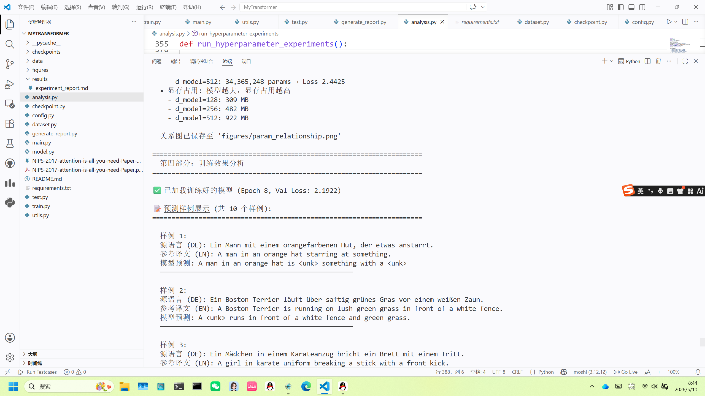
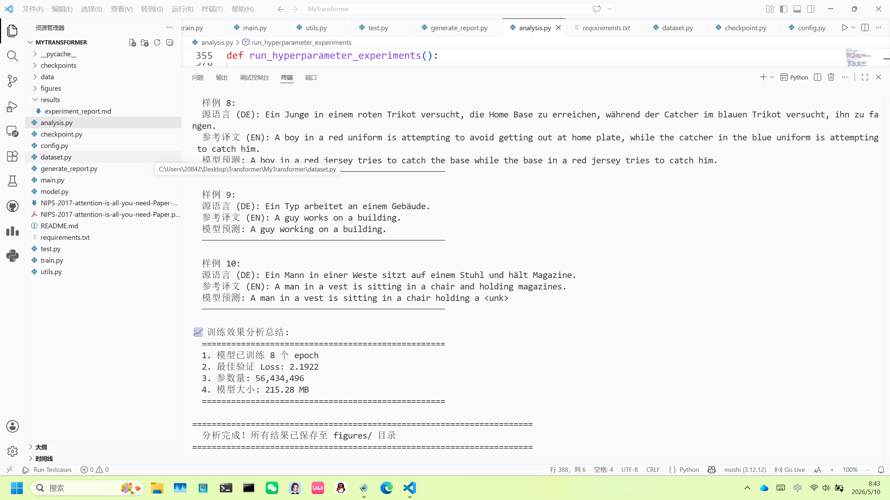

# Transformer 论文阅读与代码复现

> **《深度学习》课程 Project**  
> 基于 PyTorch 从零实现 Transformer 机器翻译模型（德语→英语）  
> 原始论文：Vaswani et al., *Attention Is All You Need*, NIPS 2017

---

## 目录

1. [项目简介](#1-项目简介)
2. [小组成员](#2-小组成员)
3. [Transformer 模型简介](#3-transformer-模型简介)
4. [目录结构](#4-目录结构)
5. [环境配置](#5-环境配置)
6. [数据集说明](#6-数据集说明)
7. [训练命令](#7-训练命令)
8. [测试命令](#8-测试命令)
9. [实验结果](#9-实验结果)
10. [模型参数统计](#10-模型参数统计)
11. [PPT、海报和报告链接](#11-ppt海报和报告链接)
12. [参考项目与参考文献](#12-参考项目与参考文献)

---

## 1. 项目简介

本项目是《深度学习》课程的期末 Project，目标是：

1. **深入阅读** Transformer 原始论文（*Attention Is All You Need*），理解其核心思想和架构设计
2. **从零复现** Transformer 模型，使用 PyTorch 实现完整的 Encoder-Decoder 架构
3. **在 Multi30K 数据集上训练**，完成德语→英语的机器翻译任务
4. **进行系统的超参数分析**，探究 d_model、n_heads、n_layers、batch_size、lr、dropout、epochs 等关键超参数对模型性能的影响
5. **撰写完整的项目报告**，记录学习过程和实验发现

### 核心特性

- 完整实现论文中的 Transformer Base 模型（d_model=512, n_layers=6, n_heads=8, d_ff=2048）
- 支持 Scaled Dot-Product Attention、Multi-Head Attention、Positional Encoding、Residual Connection + Layer Normalization
- 实现了 Padding Mask 和 Subsequent Mask（Look-ahead Mask）
- 支持 Teacher Forcing 训练策略
- 提供 7 组超参数对比实验（共 21 种配置）
- 自动生成实验报告（含 Loss 曲线、混淆矩阵、预测样例）

---

## 2. 小组成员

| 成员 | 主要负责内容 |
|------|------------|
| 胡亚鑫 | 论文精读、Transformer 原理解析、模型架构设计 |
| 胡亚鑫 | 代码实现（model.py、config.py）、模型训练与调试 |
| 赵子仪 | 数据处理（dataset.py）、词表构建、数据预处理 |
| 赵子仪 | 实验设计与分析（analysis.py）、超参数对比实验 |
| 赵子仪 | 报告撰写、PPT 制作、结果可视化 |
| 胡亚鑫| 测试评估（test.py）、预测样例分析、海报制作 |

---

## 3. Transformer 模型简介

Transformer 是 Google 在 2017 年提出的革命性序列建模架构，完全基于**注意力机制（Attention Mechanism）**，彻底抛弃了传统的 RNN 和 CNN 结构。

### 3.1 核心思想

Transformer 的核心思想可以用一句话概括：

> **用 Self-Attention 替代 RNN 的循环结构，实现完全并行的序列建模。**

在 Self-Attention 中，序列中任意两个位置之间只需要 O(1) 步计算就能直接交互，而 RNN 需要 O(n) 步。这使得 Transformer 在捕捉长程依赖方面具有根本性优势，同时训练速度大幅提升。

### 3.2 整体架构

```
                    ┌─────────────────────────┐
                    │     Output Probabilities │
                    │          ▲              │
                    │   Softmax + Linear       │
                    └──────────┬──────────────┘
                               │
            ┌──────────────────┴──────────────────┐
            │            Decoder (×N)              │
            │  ┌─────────────────────────────┐    │
            │  │  Masked Multi-Head Attention │    │
            │  │  Cross Multi-Head Attention  │    │
            │  │  Feed-Forward Network        │    │
            │  └─────────────────────────────┘    │
            └──────────────────┬──────────────────┘
                               │
            ┌──────────────────┴──────────────────┐
            │            Encoder (×N)              │
            │  ┌─────────────────────────────┐    │
            │  │  Multi-Head Attention        │    │
            │  │  Feed-Forward Network        │    │
            │  └─────────────────────────────┘    │
            └──────────────────┬──────────────────┘
                               │
            ┌──────────────────┴──────────────────┐
            │  Input Embedding + Positional Encoding│
            └─────────────────────────────────────┘
```

### 3.3 关键组件

| 组件 | 作用 | 公式/说明 |
|------|------|-----------|
| **Scaled Dot-Product Attention** | 计算序列中每个位置对其他位置的关注程度 | `Attention(Q,K,V) = softmax(QK^T/√d_k) × V` |
| **Multi-Head Attention** | 从多个子空间并行计算注意力，捕捉不同层面的语义关系 | h=8 个头，每个头 d_k=64 |
| **Positional Encoding** | 为注意力机制注入位置信息（注意力本身不感知顺序） | 正弦/余弦函数编码 |
| **Feed-Forward Network** | 对每个位置独立进行非线性变换，增强表达能力 | `FFN(x) = ReLU(xW₁+b₁)W₂+b₂` |
| **Residual Connection + LayerNorm** | 缓解深层网络的梯度消失，稳定训练 | `LayerNorm(x + Sublayer(x))` |

### 3.4 与 RNN/LSTM/GRU 的核心区别

| 特性 | RNN/LSTM/GRU | Transformer |
|------|:-----------:|:-----------:|
| 计算方式 | 顺序（逐时间步） | 并行（全序列同时） |
| 长程依赖路径 | O(n) | O(1) |
| 训练速度 | 慢（无法并行） | 快（GPU 友好） |
| 位置感知 | 天然有序 | 需要 Positional Encoding |
| 核心机制 | 门控/记忆单元 | Self-Attention |

---

## 4. 目录结构

```
MyTransformer/
├── README.md                 # 项目说明（本文件）
├── requirements.txt          # Python 依赖
├── main.py                   # 一键运行入口（train → test → analysis → report）
├── config.py                 # 模型配置与超参数实验配置
├── model.py                  # Transformer 模型完整实现
├── dataset.py                # 数据集加载与词表构建
├── train.py                  # 训练脚本
├── test.py                   # 测试/推理脚本
├── analysis.py               # 超参数对比实验与参数分析
├── generate_report.py        # 自动生成实验报告
├── utils.py                  # 工具函数（参数统计、Loss 绘图、评估指标）
├── checkpoint.py             # 模型保存与加载
│
├── data/
│   └── Multi30K/             # Multi30K 数据集（德语→英语）
│       ├── train/            # 训练集
│       ├── valid/            # 验证集
│       └── test/             # 测试集
│
├── checkpoints/              # 模型权重保存目录
│   ├── best_model.pth        # 最佳验证 Loss 模型
│   └── last_model.pth        # 最后一轮模型
│
├── figures/                  # 实验结果图表
│   ├── loss_curve.png        # 训练/验证 Loss 曲线
│   ├── confusion_matrix_*.png # 混淆矩阵
│   ├── parameter_scaling.png  # 不同规模参数量对比
│   ├── param_relationship.png # 参数量与训练时间/显存关系
│   └── loss_*.png            # 各超参数实验 Loss 曲线
│
├── results/
│   └── experiment_report.md  # 自动生成的实验报告
│
├── report/
│   └── Transformer项目报告.md # 完整项目报告（13章）
│
├── papers/
│   ├── NIPS-2017-attention-is-all-you-need-Paper.pdf
│   └── NIPS-2017-attention-is-all-you-need-Paper-精读笔记.md
│
├── PPT/                      # 课程展示 PPT（待添加）
└── poster/                   # 海报（待添加）
```

---

## 5. 环境配置

### 5.1 硬件要求

| 项目 | 最低要求 | 推荐配置 |
|------|:------:|:------:|
| GPU | 无（CPU 可运行） | NVIDIA GPU（≥4GB 显存） |
| 内存 | 4GB | 8GB+ |
| 磁盘 | 1GB | 2GB+ |

### 5.2 软件依赖

- **Python**: 3.8+
- **PyTorch**: ≥ 1.9.0
- **CUDA**: 10.2+（GPU 训练需要）

### 5.3 安装步骤

```bash
# 1. 克隆仓库
git clone <your-repo-url>
cd MyTransformer

# 2. 创建虚拟环境（推荐）
python -m venv venv
# Windows:
venv\Scripts\activate


# 3. 安装依赖
pip install -r requirements.txt

# 4. 验证安装
python -c "import torch; print(torch.__version__); print('CUDA:', torch.cuda.is_available())"
```

### 5.4 依赖列表

| 包名 | 版本要求 | 用途 |
|------|:------:|------|
| torch | ≥ 1.9.0 | 深度学习框架 |
| matplotlib | ≥ 3.3.0 | Loss 曲线与混淆矩阵绘制 |
| numpy | ≥ 1.19.0 | 数值计算 |

---

## 6. 数据集说明

### 6.1 Multi30K 数据集

本项目使用 **Multi30K** 数据集进行德语（German）→ 英语（English）的机器翻译任务。

| 数据集划分 | 文件 | 样本数 |
|-----------|------|:------:|
| 训练集 | `train/train.de` + `train/train.en` | ~29,000 |
| 验证集 | `valid/val.de` + `valid/val.en` | ~1,014 |
| 测试集 | `test/test2016.de` + `test/test2016.en` | ~1,000 |

### 6.2 数据预处理

- **词表构建**：使用频率最高的 8000 个词构建源语言和目标语言词表
- **特殊标记**：`<pad>`(0)、`<sos>`(1)、`<eos>`(2)、`<unk>`(3)
- **动态填充**：每个 batch 内按最长序列填充，减少无效计算
- **最大序列长度**：5000（位置编码支持上限）

### 6.3 数据示例

| 德语 (Source) | 英语 (Target) |
|:-------------|:-------------|
| Ein Mann mit einem orangefarbenen Hut, der etwas anstarrt. | A man in an orange hat starring at something. |
| Ein Boston Terrier läuft über saftig-grünes Gras vor einem weißen Zaun. | A Boston Terrier is running on lush green grass in front of a white fence. |
| Fünf Leute in Winterjacken und mit Helmen stehen im Schnee. | Five people wearing winter jackets and helmets stand in the snow. |

---

## 7. 训练命令

### 7.1 一键运行（推荐）

```bash
python main.py
```

该命令会按顺序执行：`train.py` → `test.py` → `analysis.py` → `generate_report.py`

### 7.2 单独训练

```bash
# 使用默认配置训练（d_model=512, n_layers=6, n_heads=8, epochs=20）
python train.py
```

### 7.3 训练配置说明

默认训练配置（可在 [`config.py`](config.py:4) 中修改）：

| 参数 | 默认值 | 说明 |
|------|:------:|------|
| d_model | 512 | 嵌入维度 |
| n_layers | 6 | Encoder/Decoder 层数 |
| n_heads | 8 | 多头注意力头数 |
| d_ff | 2048 | 前馈网络隐藏层维度 |
| dropout | 0.1 | Dropout 比率 |
| batch_size | 32 | 批次大小 |
| lr | 1e-4 | 学习率 |
| epochs | 20 | 训练轮数 |

### 7.4 训练输出

训练过程中会实时输出：

```
Epoch [1/20] | Train Loss: 4.1171 | Val Loss: 3.8523 | Time: 58.2s | GPU: 1523MB
Epoch [2/20] | Train Loss: 2.9834 | Val Loss: 2.8765 | Time: 57.8s | GPU: 1523MB
...
```

训练完成后自动保存：
- `checkpoints/best_model.pth` — 验证 Loss 最低的模型
- `checkpoints/last_model.pth` — 最后一轮的模型
- `figures/loss_curve.png` — 训练/验证 Loss 曲线

---

## 8. 测试命令

### 8.1 模型测试

```bash
# 加载最佳模型进行测试
python test.py
```

### 8.2 测试输出

测试脚本会输出：

- **验证集评估**：Token 准确率、句子准确率、精确率、召回率、F1 分数
- **测试集评估**：同上
- **预测样例**：随机选取的源语言句子、参考译文、模型预测
- **混淆矩阵**：保存至 `figures/confusion_matrix_val.png` 和 `figures/confusion_matrix_test.png`

### 8.3 超参数分析

```bash
# 运行 7 组超参数对比实验（共 21 种配置）
python analysis.py
```

该脚本会：
1. 分析模型参数量分布
2. 对比不同模型规模（Tiny → Large）的参数量变化
3. 运行超参数对比实验并绘制 Loss 曲线
4. 分析参数量与训练时间/显存/效果的关系

---

## 9. 实验结果

### 9.1 训练过程

| 指标 | 数值 |
|------|:----:|
| 总训练时间 | 1184.1s（~19.7 分钟） |
| 平均每轮时间 | 59.2s |
| 峰值显存占用 | 2293 MB |
| 训练轮数 | 20 |
| 初始训练 Loss | 4.1171 |
| 最终训练 Loss | 0.6049 |
| **最佳验证 Loss** | **2.1719** |

### 9.2 Loss 曲线


### 9.3 验证集评估

| 指标 | 数值 |
|------|:----:|
| Token 准确率 | 59.70% (7870/13182) |
| 句子准确率 | 2.56% (26/1015) |
| 精确率 (Macro) | 0.0712 |
| 召回率 (Macro) | 0.0788 |
| F1 分数 (Macro) | 0.0748 |
| 验证 Loss | 2.6644 |

### 9.4 测试集评估

| 指标 | 数值 |
|------|:----:|
| Token 准确率 | 59.48% (7659/12877) |
| 句子准确率 | 2.20% (22/1000) |
| 精确率 (Macro) | 0.0543 |
| 召回率 (Macro) | 0.0563 |
| F1 分数 (Macro) | 0.0553 |
| 测试 Loss | 2.2101 |

### 9.5 预测样例

| # | 源语言 (DE) | 参考译文 (EN) | 模型预测 |
|:--|:-----------|:-------------|:--------|
| 1 | Ein Mann mit einem orangefarbenen Hut, der etwas anstarrt. | A man in an orange hat starring at something. | A man in a hat `<unk>` something with an orange machine. |
| 2 | Ein Boston Terrier läuft über saftig-grünes Gras vor einem weißen Zaun. | A Boston Terrier is running on lush green grass in front of a white fence. | A `<unk>` is running across grass in front of a white fence. |
| 3 | Fünf Leute in Winterjacken und mit Helmen stehen im Schnee mit Schneemobilen im Hintergrund. | Five people wearing winter jackets and helmets stand in the snow, with snowmobiles in the background. | Five people wearing helmets and helmets are standing in the snow with snow in the background. |
| 4 | Leute Reparieren das Dach eines Hauses. | People are fixing the roof of a house. | People are painting the roof of a house. |

### 9.6 超参数对比实验摘要

| 超参数 | 最佳配置 | 最佳 Val Loss |
|--------|:------:|:-------------:|
| d_model | 512 | 2.1725 |
| n_heads | 2 | 2.1734 |
| n_layers | 6 | 2.1785 |
| batch_size | 64 | 2.1497 |
| lr | 1e-4 | 2.1864 |
| dropout | 0.1 | 2.1674 |
| epochs | 10 | 2.1603 |

> 完整超参数实验 Loss 曲线见 `figures/loss_*.png`，详细分析见 [`results/experiment_report.md`](results/experiment_report.md)。

### 9.7 训练结果截图





---

## 10. 模型参数统计

### 10.1 总体参数

| 指标 | 数值 |
|------|:----:|
| **总参数量** | **56,434,496 (56.43M)** |
| 可训练参数量 | 56,434,496 |
| 模型存储大小 (float32) | 215.28 MB |

### 10.2 各组件参数量分布

| 组件 | 参数量 | 占比 |
|------|:------:|:----:|
| Embedding（源+目标） | 8,192,000 | 14.52% |
| Encoder 堆栈 | 18,914,304 | 33.52% |
| Decoder 堆栈 | 25,224,192 | 44.70% |
| 输出投影层 | 4,104,000 | 7.27% |

### 10.3 Encoder 单层参数组成

| 子组件 | 参数量 | 占比 |
|--------|:------:|:----:|
| 自注意力 (Multi-Head Attention) | 1,048,576 | ~33.3% |
| 前馈网络 (Feed-Forward) | 2,097,152 | ~66.6% |
| 层归一化 (LayerNorm) | 2,048 | ~0.1% |

### 10.4 不同规模模型参数量

| 规模 | d_model | Layers | Heads | d_ff | 参数量 | 模型大小 |
|:----:|:------:|:------:|:-----:|:----:|:------:|:--------:|
| Tiny | 64 | 2 | 2 | 256 | 1.78M | 6.8 MB |
| Small | 128 | 3 | 4 | 512 | 4.47M | 17.0 MB |
| Medium | 256 | 4 | 4 | 1024 | 13.52M | 51.6 MB |
| **Base** | **512** | **6** | **8** | **2048** | **56.43M** | **215.3 MB** |
| Large | 1024 | 6 | 16 | 4096 | 200.94M | 766.5 MB |


### 10.5 关键发现

1. **参数量主要受 d_model 控制**，呈平方级增长（`4 × d_model²` 来自注意力投影矩阵）
2. **Feed-Forward 是参数大户**，占 Encoder 单层约 66.6%
3. **Decoder 比 Encoder 参数多**，因为 Decoder 每层多一个 Cross-Attention
4. **LayerNorm 参数几乎可忽略**，仅占单层的 0.1%

---

## 11. PPT、海报和报告链接

| 文件 | 路径 | 说明 |
|------|------|------|
| 完整项目报告 | [`report/Transformer项目报告.md`](report/Transformer项目报告.md) | 13 章完整报告，含论文解读与代码分析 |
| 实验报告 | [`results/experiment_report.md`](results/experiment_report.md) | 自动生成的实验数据报告 |
| 论文精读笔记 | [`papers/NIPS-2017-attention-is-all-you-need-Paper-精读笔记.md`](papers/NIPS-2017-attention-is-all-you-need-Paper-精读笔记.md) | 论文逐节精读笔记 |
| 课程 PPT | `PPT/` | （待添加） |
| 海报 | `poster/` | （待添加） |

---

## 12. 参考项目与参考文献

### 12.1 参考文献

1. **Vaswani, A., Shazeer, N., Parmar, N., Uszkoreit, J., Jones, L., Gomez, A. N., Kaiser, Ł., & Polosukhin, I. (2017).** *Attention Is All You Need.* In Advances in Neural Information Processing Systems (NIPS 2017), pp. 5998–6008.  
   📄 [arXiv:1706.03762](https://arxiv.org/abs/1706.03762)

2. **Bahdanau, D., Cho, K., & Bengio, Y. (2015).** *Neural Machine Translation by Jointly Learning to Align and Translate.* ICLR 2015.  
   📄 [arXiv:1409.0473](https://arxiv.org/abs/1409.0473)

3. **Sutskever, I., Vinyals, O., & Le, Q. V. (2014).** *Sequence to Sequence Learning with Neural Networks.* NIPS 2014.  
   📄 [arXiv:1409.3215](https://arxiv.org/abs/1409.3215)

### 12.2 参考的开源项目

本项目在实现过程中参考了以下开源项目：

| 项目 | 说明 |
|------|------|
| [The Annotated Transformer](http://nlp.seas.harvard.edu/annotated-transformer/) | Harvard NLP 的 Transformer 逐行注释实现，提供了极好的学习参考 |
| [PyTorch 官方 Transformer 教程](https://pytorch.org/tutorials/beginner/transformer_tutorial.html) | PyTorch 官方的 Transformer 语言模型教程 |
| [Multi30K 数据集](https://github.com/multi30k/dataset) | 多语言图像描述数据集，本项目使用其德语→英语翻译子集 |

### 12.3 声明

- 本项目代码为课程学习目的从零编写，核心模块（Attention、Multi-Head Attention、Encoder/Decoder、Positional Encoding 等）均基于论文描述独立实现
- 代码结构和部分工具函数参考了上述开源项目，已在代码注释中标注
- 未直接复制他人项目代码

---

## 快速开始

```bash
# 1. 安装依赖
pip install -r requirements.txt

# 2. 一键运行（训练 + 测试 + 分析 + 报告生成）
python main.py

# 3. 查看结果
# - Loss 曲线：figures/loss_curve.png
# - 实验报告：results/experiment_report.md
# - 完整报告：report/Transformer项目报告.md
```

---

> **课程**：深度学习 | **论文**：Attention Is All You Need (NIPS 2017) | **任务**：德语→英语机器翻译 | **框架**：PyTorch