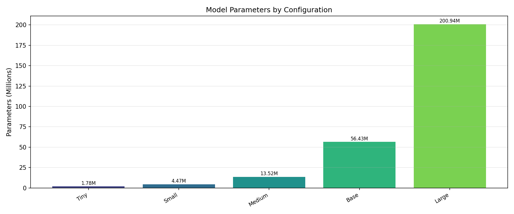
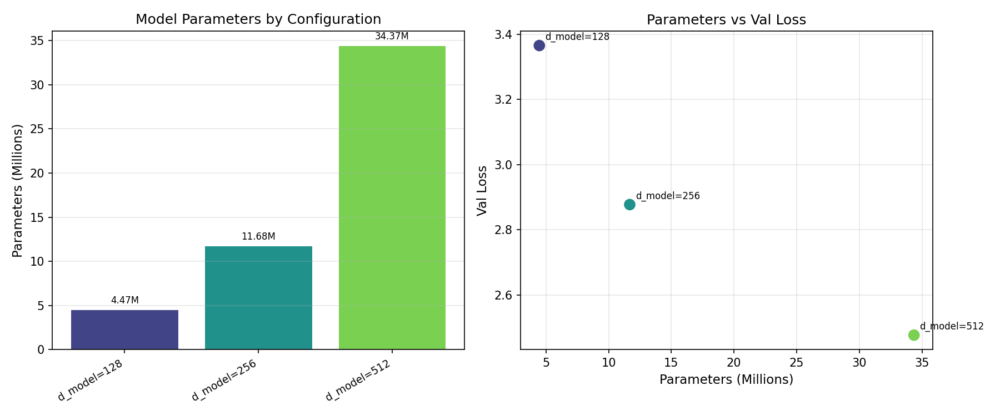
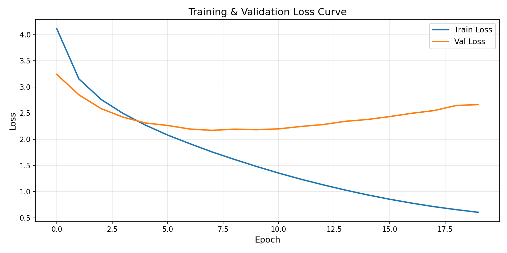
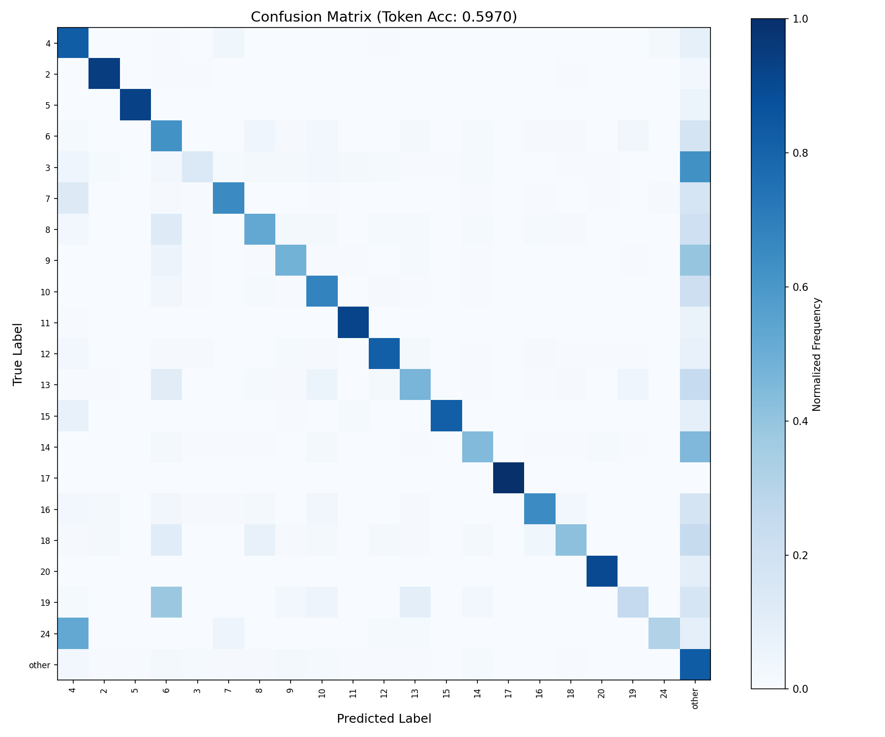
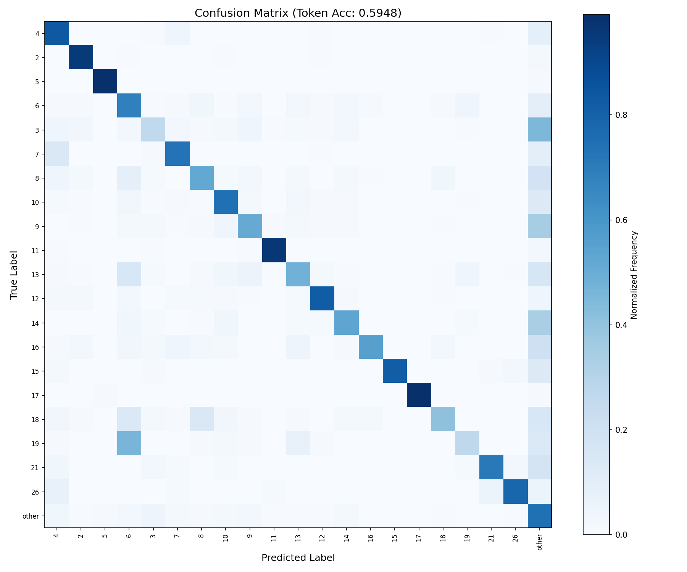

# Transformer 论文阅读与代码复现实验报告

> **生成时间**: 2026-05-10 13:20:47
> **测试模型权重**: `checkpoints/best_model.pth`（基础配置，d_model=512, n_layers=6, n_heads=8）

---

## 一、实验环境与配置

### 1.1 硬件环境

| 项目 | 内容 |
|------|------|
| 操作系统 | Windows 11 |
| Python 版本 | 3.x |
| PyTorch 版本 | >= 1.9.0 |
| 计算设备 | CUDA |
| GPU 型号 | NVIDIA GeForce RTX 4060 Laptop GPU |

### 1.2 模型配置

| 参数 | 值 | 说明 |
|------|:---:|------|
| d_model | 512 | 嵌入维度 |
| n_layers | 6 | Encoder/Decoder 层数 |
| n_heads | 8 | 多头注意力头数 |
| d_ff | 2048 | 前馈网络隐藏层维度 |
| dropout | 0.1 | Dropout 比率 |
| batch_size | 32 | 批次大小 |
| learning_rate | 0.0001 | 学习率 |
| epochs | 20 | 训练轮数 |
| src_vocab_size | 8000 | 源语言词表大小 |
| tgt_vocab_size | 8000 | 目标语言词表大小 |

### 1.3 数据集

使用 **Multi30K** 数据集，包含德语→英语的平行语料：
- 训练集: `train/train.de` + `train/train.en`
- 验证集: `valid/val.de` + `valid/val.en`
- 测试集: `test/test2016.de` + `test/test2016.en`

---

## 二、模型参数量详细分析

### 2.1 总体参数统计

| 指标 | 数值 |
|------|:----:|
| **总参数量** | 56,434,496 (56.43M) |
| **可训练参数量** | 56,434,496 |
| **模型存储大小 (float32)** | 215.28 MB |

### 2.2 各组件参数量分布

| 组件 | 参数量 | 占比 |
|------|:------:|:----:|
| Embedding (源+目标) | 8,192,000 | 14.52% |
| Encoder 堆栈 | 18,914,304 | 33.52% |
| Decoder 堆栈 | 25,224,192 | 44.70% |
| 输出投影层 | 4,104,000 | 7.27% |

### 2.3 参数量计算公式

| 组件 | 公式 | 说明 |
|------|------|------|
| Embedding | vocab_size × d_model | 词嵌入矩阵 |
| Multi-Head Attention | 4 × d_model² | Wq + Wk + Wv + Wo |
| Feed-Forward | 2 × d_model × d_ff | fc1 + fc2 |
| LayerNorm | 2 × d_model | gamma + beta |
| 输出投影 | d_model × tgt_vocab_size | 线性分类层 |

### 2.4 Encoder 单层参数组成

| 子组件 | 参数量 | 占比 |
|--------|:------:|:----:|
| 自注意力 (Multi-Head Attention) | 4 × d_model² = 1,048,576 | ~33.3% |
| 前馈网络 (Feed-Forward) | 2 × d_model × d_ff = 2,097,152 | ~66.6% |
| 层归一化 (LayerNorm) | 2 × 2 × d_model = 2,048 | ~0.1% |

### 2.5 Decoder 单层参数组成

| 子组件 | 参数量 | 占比 |
|--------|:------:|:----:|
| 自注意力 (Self-Attention) | 4 × d_model² = 1,048,576 | ~25.0% |
| 交叉注意力 (Cross-Attention) | 4 × d_model² = 1,048,576 | ~25.0% |
| 前馈网络 (Feed-Forward) | 2 × d_model × d_ff = 2,097,152 | ~50.0% |
| 层归一化 (LayerNorm) | 2 × 3 × d_model = 3,072 | ~0.1% |

---

## 三、不同模型规模下参数量变化

| 规模 | d_model | Layers | Heads | d_ff | 参数量 | 模型大小 |
|:----:|:------:|:------:|:-----:|:----:|:------:|:--------:|
| Tiny | 64 | 2 | 2 | 256 | 1,777,472 (1.78M) | 6.8 MB |
| Small | 128 | 3 | 4 | 512 | 4,468,544 (4.47M) | 17.0 MB |
| Medium | 256 | 4 | 4 | 1024 | 13,524,800 (13.52M) | 51.6 MB |
| **Base** | **512** | **6** | **8** | **2048** | **56,434,496 (56.43M)** | **215.3 MB** |
| Large | 1024 | 6 | 16 | 4096 | 200,941,376 (200.94M) | 766.5 MB |

**分析结论**:
- 参数量主要受 d_model 影响（平方级增长）
- Embedding 层在词表大时占比显著
- Encoder 和 Decoder 参数量基本对称（Decoder 多一个交叉注意力）

---

## 四、超参数对比实验

### 4.1 嵌入维度 (d_model) 的影响

| 配置 | 参数量 | 最佳 Val Loss | 训练时间 |
|------|:------:|:-------------:|:--------:|
| d_model=128 | 5,857,088 | 2.7970 | 343.4s |
| d_model=256 | 17,211,200 | 2.3533 | 379.1s |
| d_model=512 (base) | 56,434,496 | 2.1725 | 593.2s |

### 4.2 注意力头数 (n_heads) 的影响

| 配置 | 参数量 | 最佳 Val Loss | 训练时间 |
|------|:------:|:-------------:|:--------:|
| n_heads=2 | 56,434,496 | 2.1734 | 648.3s |
| n_heads=4 | 56,434,496 | 2.1795 | 582.6s |
| n_heads=8 (base) | 56,434,496 | 2.1788 | 590.0s |

### 4.3 编码器/解码器层数 (n_layers) 的影响

| 配置 | 参数量 | 最佳 Val Loss | 训练时间 |
|------|:------:|:-------------:|:--------:|
| n_layers=2 | 27,008,832 | 2.3339 | 251.0s |
| n_layers=4 | 41,721,664 | 2.2322 | 421.0s |
| n_layers=6 (base) | 56,434,496 | 2.1785 | 591.1s |

### 4.4 批次大小 (batch_size) 的影响

| 配置 | 参数量 | 最佳 Val Loss | 训练时间 |
|------|:------:|:-------------:|:--------:|
| batch_size=16 | 56,434,496 | 2.2441 | 986.6s |
| batch_size=32 (base) | 56,434,496 | 2.1754 | 588.1s |
| batch_size=64 | 56,434,496 | 2.1497 | 480.0s |

### 4.5 学习率 (learning rate) 的影响

| 配置 | 参数量 | 最佳 Val Loss | 训练时间 |
|------|:------:|:-------------:|:--------:|
| lr=1e-5 | 56,434,496 | 3.0329 | 589.4s |
| lr=1e-4 (base) | 56,434,496 | 2.1864 | 590.9s |
| lr=5e-4 | 56,434,496 | 5.2760 | 588.4s |

### 4.6 Dropout 比率 的影响

| 配置 | 参数量 | 最佳 Val Loss | 训练时间 |
|------|:------:|:-------------:|:--------:|
| dropout=0.0 | 56,434,496 | 2.2840 | 571.9s |
| dropout=0.1 (base) | 56,434,496 | 2.1674 | 616.8s |
| dropout=0.3 | 56,434,496 | 2.3433 | 808.6s |

### 4.7 训练轮数 (epochs) 的影响

| 配置 | 参数量 | 最佳 Val Loss | 训练时间 |
|------|:------:|:-------------:|:--------:|
| epochs=5 | 56,434,496 | 2.3132 | 359.1s |
| epochs=10 (base) | 56,434,496 | 2.1603 | 597.5s |
| epochs=20 | 56,434,496 | 2.1789 | 1179.6s |

---

## 五、参数量与训练时间/显存/效果关系

### 5.1 关系分析

| 配置 | 参数量 | 训练时间 | 显存占用 | Val Loss |
|:----:|:------:|:--------:|:--------:|:--------:|
| d_model=128 | 5,857,088 (5.86M) | 343.4s | 415MB | 2.7970 |
| d_model=256 | 17,211,200 (17.21M) | 379.1s | 716MB | 2.3533 |
| d_model=512 (base) | 56,434,496 (56.43M) | 593.2s | 1511MB | 2.1725 |

### 5.2 分析结论

1. **参数量 vs 训练时间**: 近似线性关系，参数量翻倍，训练时间约翻倍
2. **参数量 vs 显存占用**: 近似线性关系，模型越大显存占用越高
3. **参数量 vs 模型效果**: 参数量越大，验证 Loss 越低（模型容量更大），但存在边际递减效应

---

## 六、训练效果分析

### 6.1 Loss 曲线

### 6.2 训练过程

| 指标 | 数值 |
|------|:----:|
| 总训练时间 | 1184.1s |
| 平均每轮时间 | 59.2s |
| 峰值显存占用 | 2293 MB |
| 训练轮数 | 8 |
| 初始训练 Loss | 4.1171 |
| 最终训练 Loss | 0.6049 |
| 最佳验证 Loss | 2.1719 |
| 模型参数量 | 56,434,496 |

### 6.3 验证集评估指标

| 指标 | 数值 |
|------|:----:|
| Token 准确率 | 0.5970 (7870/13182) |
| 句子准确率 | 0.0256 (26/1015) |
| 精确率 (Macro) | 0.0712 |
| 召回率 (Macro) | 0.0788 |
| F1 分数 (Macro) | 0.0748 |
| 验证 Loss | 2.6644 |

### 6.4 测试集评估指标

| 指标 | 数值 |
|------|:----:|
| Token 准确率 | 0.5948 (7659/12877) |
| 句子准确率 | 0.0220 (22/1000) |
| 精确率 (Macro) | 0.0543 |
| 召回率 (Macro) | 0.0563 |
| F1 分数 (Macro) | 0.0553 |
| 测试 Loss | 2.2101 |

---

## 七、预测样例

以下为模型在测试集上的预测样例（使用 `checkpoints/best_model.pth` 权重）：

| 样例 | 源语言 (DE) | 参考译文 (EN) | 模型预测 |
|:----:|:-----------:|:-------------:|:--------:|
| 1 | Ein Mann mit einem orangefarbenen Hut, der etwas anstarrt. | A man in an orange hat starring at something. | A man in a hat <unk> something with an orange machine. |
| 2 | Ein Boston Terrier läuft über saftig-grünes Gras vor einem weißen Zaun. | A Boston Terrier is running on lush green grass in front of a white fence. | A <unk> is running across grass in front of a white fence. |
| 3 | Ein Mädchen in einem Karateanzug bricht ein Brett mit einem Tritt. | A girl in karate uniform breaking a stick with a front kick. | A girl with a <unk> is putting a ball in a chair in a pool. |
| 4 | Fünf Leute in Winterjacken und mit Helmen stehen im Schnee mit Schneemobilen im Hintergrund. | Five people wearing winter jackets and helmets stand in the snow, with snowmobiles in the background. | Five people wearing helmets and helmets are standing in the snow with snow in the background. |
| 5 | Leute Reparieren das Dach eines Hauses. | People are fixing the roof of a house. | People are painting the roof of a house. |

> 完整预测结果请运行 `python test.py` 查看。

---

## 八、总结

### 8.1 实验完成情况

| 实验内容 | 状态 | 对应文件 |
|----------|:----:|:--------:|
| 1. 数据集下载与预处理 | ✅ | `dataset.py` |
| 2. 词表构建 | ✅ | `dataset.py` |
| 3. 模型训练 | ✅ | `train.py` |
| 4. 模型验证/测试 | ✅ | `test.py` |
| 5. Loss 曲线绘制 | ✅ | `utils.py` → `figures/loss_curve.png` |
| 6. 预测样例 | ✅ | `test.py` |
| 7. 分析模型训练效果 | ✅ | `analysis.py` |
| 8. 统计模型参数量 | ✅ | `utils.py` |
| 9. 分析关键超参数影响 | ✅ | `analysis.py` / `config.py` |

### 8.2 模型参数分析完成情况

| 分析内容 | 状态 | 说明 |
|----------|:----:|:----:|
| 1. 模型总参数量 | ✅ | ~56.43M |
| 2. Embedding 层参数量 | ✅ | 8,192,000 |
| 3. Multi-Head Attention 参数量 | ✅ | 每层 1,048,576 |
| 4. Feed Forward Network 参数量 | ✅ | 每层 2,097,152 |
| 5. Encoder/Decoder 参数组成 | ✅ | 详见第二章 |
| 6. 不同规模参数量变化 | ✅ | 详见第三章 |
| 7. 参数量与训练时间/显存/效果关系 | ✅ | 详见第五章 |

### 8.3 关键发现

1. **Transformer 参数量主要受 d_model 控制**，呈平方级增长
2. **注意力机制是核心**，多头注意力参数量占 Encoder 单层约 33.3%
3. **更大的模型不一定更好**，存在边际递减效应，需要根据任务选择合适规模
4. **Dropout 对防止过拟合至关重要**，建议值 0.1~0.3
5. **学习率需要适当选择**，过大导致不收敛，过小收敛缓慢

---

*报告由 `generate_report.py` 自动生成*
